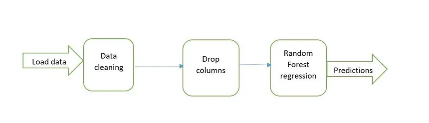

Pipelines chains together multiple steps so that output of each step is used as input to the next step.

Pipelines makes it easy to apply the same preprocessing to train and test

when data comes to your model from a user it is not processed if piplines are not used then you have to do the same preprocessing steps again that were done when designing the model.

Pipeline Example :
